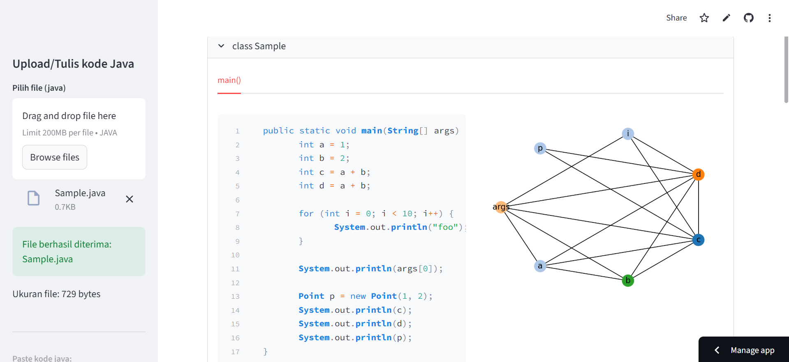

# TugasStrukdis

## Cara Menjalankan Aplikasi:
-buka link https://jvra-app.streamlit.app/ untuk WEB atau ketik ini di terminal `pip install git+https://github.com/KumaraIvanA/TugasStrukdis.git` setelah itu ketik **jvra** di terminal.

**Sangat disarankan membaca README ini dari link github** https://github.com/KumaraIvanA/TugasStrukdis.git

## Teknologi yang Digunakan

Berikut adalah teknologi dan library yang digunakan dalam pengembangan aplikasi ini:

| Kategori | Teknologi | Deskripsi |
| :--- | :--- | :--- |
| **Bahasa Utama** | Python | Bahasa pemrograman utama aplikasi. |
| **Frontend/UI** | Streamlit | Membangun antarmuka web dan integrasi backend. |
| **Graf & Data** | NetworkX | Membuat dan memanipulasi struktur graf/jaringan. |
| | Matplotlib | Visualisasi data dan grafis. |
| | gcol | Algoritma pewarnaan graf (*graph coloring*). |
| | Pandas | Pengolahan data (DataFrame). |
| **Analisis Code** | Javalang | Membaca dan menganalisis source code Java (Parsing). |
| **Utilitas** | OS & Sys | Interaksi dengan sistem operasi dan interpreter Python. |
| | Base64 | Encoding data biner ke format string ASCII. |

## Panduan Penggunaan Fitur

Di halaman utama, kami menyediakan dua cara mudah untuk menganalisis kode Java Anda. Anda bisa melihat tombol **Browse File** untuk mengunggah file `.java` dari komputer, atau area teks **Paste kode Java** jika Anda ingin menyalin dan menempel kode secara langsung, jika sudah mengupload salah satu maka anda bisa menekan tombol **SUBMIT**.

**Perhatian:** Sistem kami hanya memproses satu sumber data dalam satu waktu. Mohon pilih salah satu cara saja (Upload atau Paste) untuk menghindari kesalahan.

## Tampilan jika anda sudah mengupload file Java

##  Tim Pengembang

Berikut adalah anggota tim yang berkontribusi dalam proyek ini beserta tanggung jawab masing-masing:

| Nama | NPM | Peran & Tanggung Jawab |
| :--- | :--- | :--- |
| **Ivan** | 6182401018 | **Algorithm Engineer** Merancang dan mengembangkan algoritma pewarnaan graf |
| **Kendrick Hansell Setiawan** | 6182401049 | **UI/UX Designer & Frontend** Merancang antarmuka aplikasi yang interaktif untuk mempermudah visualisasi data. |
| **Rafael Bintang** | 6182401084 | **Multimedia Specialist** Membuat  video interaktif untuk menjelaskan cara kerja register. |
| **Matthew Felizio** | 6182401067 | **Graphic Designer** Merancang dan membuat poster yang menarik untuk menjelaskan materi berkaitan dengan alokasi register. |